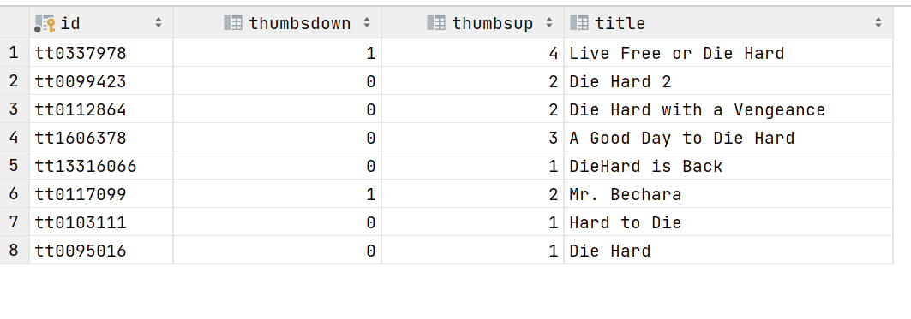

# Movie Search

A Java Spring Boot application which allows user to search for any movie by its name, title etc.

This Application connects to IMDB Free API to fetch the movie details.

### Design

Following is the design to accomplish the requirements.

1. The IMDB API is invoked from this app by using the REST API Calls.
2. A REST API service is built using the Spring Boot App.

## Requirements

For building and running the application you need:

- [JDK 1.8](http://www.oracle.com/technetwork/java/javase/downloads/jdk8-downloads-2133151.html)
- [Maven 3](https://maven.apache.org)
- [MySQL](https://www.mysql.com/downloads/)

## Running the application locally

There are several ways to run a Spring Boot application on your local machine. One way is to execute the `main` method
in the `com.jessica.movierater.MovieRaterApplication` class from your IDE.

Alternatively you can use
the [Spring Boot Maven plugin](https://docs.spring.io/spring-boot/docs/current/reference/html/build-tool-plugins-maven-plugin.html)
like so:

```shell
mvn spring-boot:run
```

* First page will ask you to enter the movie name, title etc.
* Second page will display the movie details, when you click like or dislike, db operation happens and store it like the
  given image below
* You need to go to `MYSQL workbench` and fire `Select * from movie`
  

## Technology stack & other Open-source libraries

### Data

* [MySQL](https://www.mysql.com/) - Open-Source Relational Database Management System

### Client - Frontend/UI

* [Thymeleaf](https://www.thymeleaf.org/) - Modern server-side Java template engine for both web and standalone
  environments.

### Server - Backend

* [JDK](http://www.oracle.com/technetwork/java/javase/downloads/jdk8-downloads-2133151.html) - Java™ Platform, Standard
  Edition Development Kit
* [Spring Boot](https://spring.io/projects/spring-boot) - Framework to ease the bootstrapping and development of new
  Spring Applications
* [Maven](https://maven.apache.org/) - Dependency Management

### Prerequisites

* You need to have **MySQL** installed on your machine to run the application. Using the `MySQL Workbench` or on any
  other MySQL client/console, create a database/schema named `demo`.

~~~sql
-- create schema
CREATE SCHEMA demo;
-- use schema
USE
demo;
~~~

After creating the database/schema, you need to add your **MySQL** `username` and `password` in
the `application.properties` file on `src/main/resource`. The lines that must be modified are as follows:

```properties
spring.datasource.url=jdbc:mysql://localhost:3306/demo
spring.datasource.username=yourusername
spring.datasource.password=password

